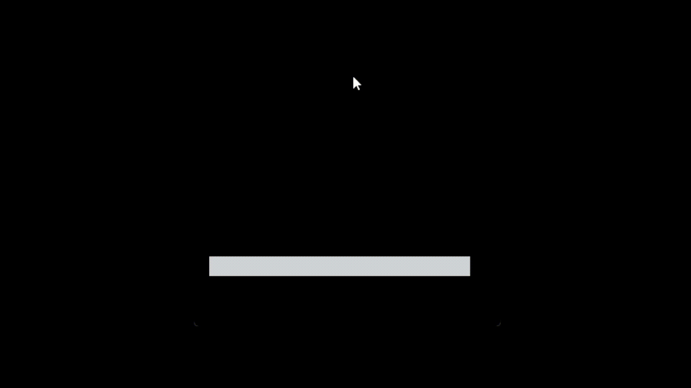

# Sand Simulation with Python

- [Pygame](https://www.pygame.org/news): python lib for making games built on top of SDL
- [Pymunk](http://www.pymunk.org/en/latest/#): python lib for 2d physics(game,simulation or demo) built on top of Chipmunk2D

## WARNING!
This is an old project when i was studying how to implement physics in pygame games. It is not optimized, and the code is "XGH"like, but its a project that i liked doing it.

## Usage:
```bash
pip install pygame
pip install pymunk
python main.py
```
hold left mouse button to create sand

that's it!

### Demo



